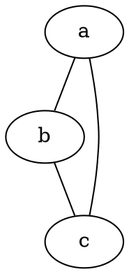

## Installation

```
brew install graphviz
```




```bash
$ dot -Tpng DocName.dot -o DocName.png
```

## AWS Example
```
digraph G {

compound=true;
  subgraph cluster0 {
  	label = "AWS VPC"; 
		"AWS RDS (SQL Server)" -> "Identity Server 4";
		"Identity Server 4" -> "AWS RDS (SQL Server)";
		"Identity Server 4" -> "AWS Elasticache (Redis)";
		"AWS Elasticache (Redis)" -> "Identity Server 4";

		subgraph cluster2 {
			label = "On-Premise Data Center";
			"Siva DB" "MyJS DB" "jobsDB DB";
		}

		subgraph cluster3 {
			label = "AWS Network Load Balancer";
			"Instance 1" "Instance 2" "Instance n";
		}

		subgraph cluster4 {
			label = "AWS Container Service";
			"AWS ECR" -> "AWS ECS" [label="pulls Docker image"];
		}

		subgraph cluster5 {
 			label = "Application";
  		       "Identity Server 4"  [shape=box];
			node [ style=filled]
			color=blue;
		}

		"AWS ECS" -> "Instance 1" [ltail=cluster4, lhead=cluster3];
		"Instance 2" ->  "Identity Server 4" [ltail=cluster3, lhead=cluster5];
		"Identity Server 4"  ->  "MyJS DB" [ltail=cluster5, lhead=cluster2];
 	} 

  subgraph cluster1 {
		label = "Public IP";
		node [style=filled,color=white];
		style=filled;
		color=lightgrey;   

		"Mobile Client" -> "AWS API Gateway"
		"Browser Client" -> "AWS API Gateway"
		"AWS API Gateway" -> "Identity Server 4" [label="public API"]
	}
}
```


