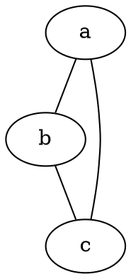

## Installation

```
brew install graphviz
```




```bash
$ dot -Tpng DocName.dot -o DocName.png
```

## AWS Example
```
digraph G {
   subgraph cluster0 {

   label = "AWS VPC";
   
  "Application (Identity Server 4)"  [shape=box, style=filled, color=lightblue];

  "AWS ECR" -> "AWS ECS" [label="pulls Docker image"]
  "AWS ECS" -> "Instance 1"
  "AWS ECS" -> "Instance 2"
  "AWS ECS" -> "Instance n" [label="AWS Network Load Balancer"]
  "Instance 1" ->  "Application (Identity Server 4)" 
  "Instance 2" ->  "Application (Identity Server 4)" 
  "Instance n" ->  "Application (Identity Server 4)" 

  "AWS RDS (SQL Server)" -> "Application (Identity Server 4)"
  "Application (Identity Server 4)" -> "AWS RDS (SQL Server)" 
  "Application (Identity Server 4)" -> "AWS Elasticache (Redis)"
  "AWS Elasticache (Redis)" -> "Application (Identity Server 4)"
 } 


   subgraph cluster1 {

   label = "Public IP";

    node [style=filled,color=white];
   style=filled;
   color=lightgrey;   

  "Mobile Client" -> "AWS API Gateway"
  "Browser Client" -> "AWS API Gateway"
  "AWS API Gateway" -> "Application (Identity Server 4)" [label="public API"]
 }
}

```
